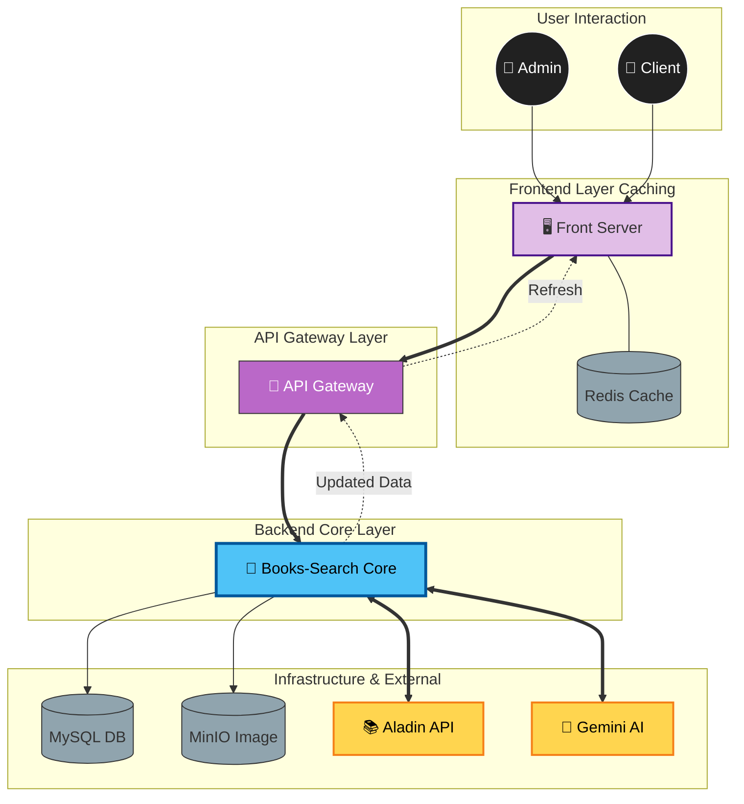
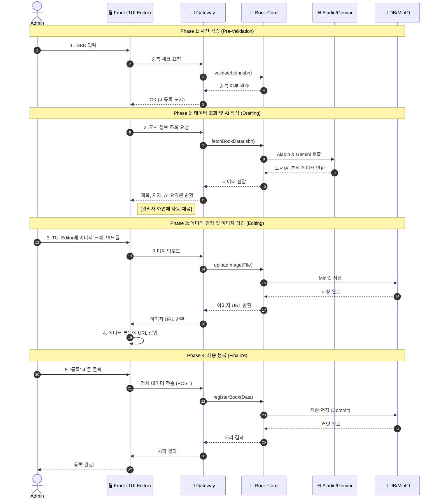
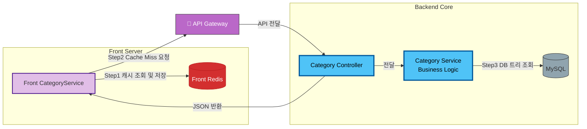

🏗️ 도서 서비스 기술 스택 및 아키텍처 (Tech Stack & Architecture)

  작성자: hetgwi01
  프로젝트: Daiso-Shop (MSA 기반 도서 쇼핑몰)

  ## 1. 기술 스택 (Tech Stack)

  #### Backend (Books-Search Service)
   * Language: Java 21
   * Framework: Spring Boot 3.3.x
   * ORM: Spring Data JPA (Hibernate)
   * Database: MySQL 8.0 (Source-Replica)
   * Build Tool: Maven (Multi-module)
   * API Communication: Spring Cloud OpenFeign
   * External API: Aladin Open API (도서 원천 데이터 확보)
   * AI Integration: Google Gemini AI (데이터 가공 및 보완)
   * Storage: MinIO (Object Storage)
   * Message Queue: RabbitMQ (Event Driven Architecture)
   * Testing: JUnit 5, Mockito
   * Code Quality: SonarQube

  ####  Frontend (FrontServer)
   * Language: Java, JavaScript (ES6+)
   * Template Engine: Thymeleaf
   * UI Libraries: Bootstrap 5, NHN Toast UI Editor
   * Client: Spring Cloud OpenFeign

  #### Infrastructure
   * Gateway: Spring Cloud Gateway
   * Service Discovery: Netflix Eureka
   * CI/CD: GitHub Actions, Docker

  ---

  ## 2. 시스템 아키텍처 및 데이터 흐름 (System Architecture & Data Flow)

 #### 1. 🏛 System Landscape (Diagonal Flow)

---

 #### 2. 📝 TUI Editor & Registration Process (Detailed Sequence)

---

 #### 3. 🧩 Core Logic & Redis Strategy

  ---

  ## 3. 핵심 아키텍처 특징 (Key Architectural Features)

  #### A. AI 기반 지능형 도서 등록 파이프라인
   1. ISBN 중복 검사: 관리자가 ISBN을 입력하면 먼저 로컬 MySQL DB를 조회하여 중복 여부를 확인합니다.
   2. 외부 데이터 확보 (Aladin Open API): DB에 없는 신규 도서일 경우, 알라딘 Open API를 호출하여 도서의 기본 메타데이터(제목, 저자, 출판사, 원본 이미지 등)를 확보합니다.
   3. AI 데이터 가공 (Gemini AI):
       * 알라딘에서 가져온 Raw 데이터는 우리 서비스의 카테고리 분류나 태그 정책과 맞지 않는 경우가 많습니다.
       * 확보한 데이터를 Gemini AI에게 전송하여, 우리 서비스 포맷에 맞는 카테고리 매핑, 태그 추출, 부족한 상세 설명 보완 작업을 수행하도록 하고 그 결과를 받아 자동 입력합니다.

  #### B. 통신 최적화 컨트롤러 설계 (Bulk Data Transfer)
   * `BookManagementController` 구현:
       * 관리자 페이지나 메인 페이지 렌더링 시 필요한 작가 목록, 태그 목록, 카테고리 트리 등 수많은 메타데이터를 개별 API로 요청할 경우 네트워크 오버헤드(RTT)가 발생합니다.
       * 이를 해결하기 위해 메타데이터 전용 컨트롤러(`BookManagementController`)를 별도로 설계하여, 한 번의 API 호출로 화면 렌더링에 필요한 모든 메타데이터를 통합(Aggregated)하여 반환하도록 설계했습니다. 이를 통해 빈번한 통신을 획기적으로 줄였습니다.

  #### C. 성능 최적화 아키텍처
   1. Browser & Server Caching:
       * 이미지 프록시 응답에 Cache-Control을 적용해 브라우저 단에서 이미지를 캐싱.
       * 변경이 적은 카테고리 정보는 FrontServer 메모리에 캐싱하여 DB 조회 제거.
   2. Database Access Optimization:
       * JSON_ARRAYAGG를 활용한 Native Query로 N+1 문제를 해결하고 단일 쿼리로 데이터 집계.

  #### D. 객체 스토리지 및 보안
   * Proxy Pattern: MinIO 내부 URL을 노출하지 않고 FrontServer를 경유하는 프록시 패턴을 적용하여 보안성을 강화하고 HTTPS 혼합 콘텐츠 문제를 해결했습니다.

  ---

  ## 4. 도서 서비스 내부 레이어 구조 (Internal Layering)

   * Controller Layer:
       * BookV2Controller: 일반 사용자용 조회 API.
       * BookManagementController: 관리자용 및 메타데이터 통합 조회 API (통신 최적화).
   * Facade Layer (`BookFacade`):
       * AI 등록 프로세스(DB 조회 -> 알라딘 API -> Gemini AI -> DB 저장)의 전체 흐름을 제어.
       * 트랜잭션 관리 및 외부 시스템 통신 조율.
   * Core Service Layer (`BookCoreService`):
       * 순수 도서 도메인 로직(Entity 상태 변경, 유효성 검사) 담당.
   * Repository Layer:
       * JPA와 Native Query(Projection)를 혼용하여 생산성과 성능의 균형 유지.
